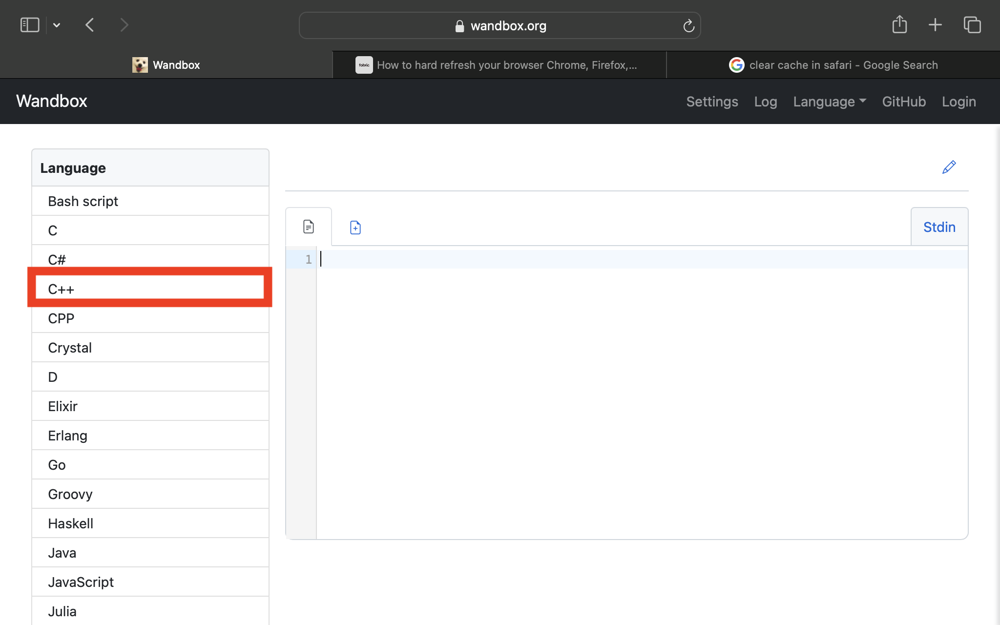
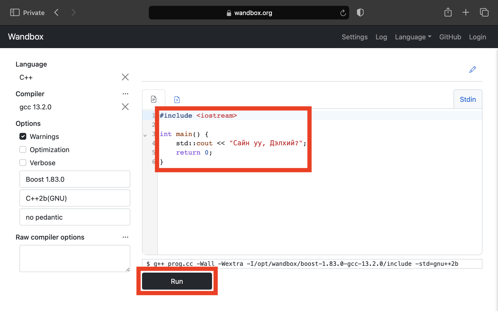
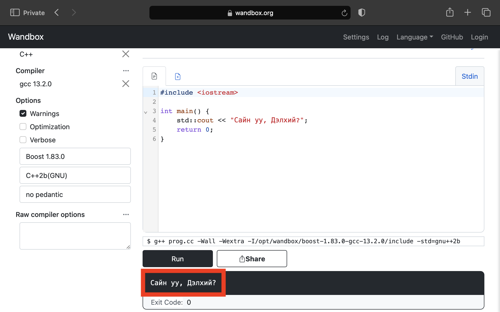

# "Сайн уу, Дэлхий?" програмыг ажиллуулах

C++ хэлний үндсийг сурах эхний алхмын хүрээнд доорх программыг ажиллуулцгаая.

```cpp
#include <iostream>

int main() {
    std::cout << "Сайн уу, Дэлхий?";
    return 0;
}
```

### Wandbox
1. Үүний тулд эхлээд [wandbox](https://wandbox.org) онлайн компилер руу ороод `C++` хэлийг сонгоно.


2. Дараа нь кодыг хуулан оруулж `Run` товчийг дарна.


3. Ингэснээр үр дүн нь хэвлэгдэнэ.


Баяр хүргэе! Та C++ програмыг амжилттай ажиллууллаа! Дараагийн хичээлээр бид "Сайн уу, Дэлхий?" програмыг задлан шинжилнэ.


